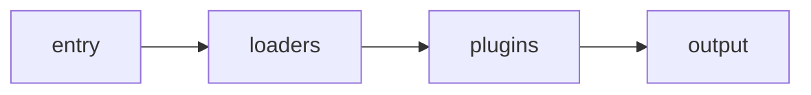

[toc]
## 安装
> npm install webpack webpack-cli --save-dev

## 本质
webpack 是一个现代 JavaScript 应用程序的静态模块打包器(module bundler)。当 webpack 处理应用程序时，它会递归地构建一个依赖关系图(dependency graph)，其中包含应用程序需要的每个模块，然后将所有这些模块打包成一个或多个 bundle

## 打包
> webpack ./js/index.js

上面命令会使用 webpack 默认的一些配置对模块文件进行打包，并把打包后的文件输出到默认创建的 ./dist 目录下，打包后的文件名称默认为 main.js

### 核心配置
#### mode
模式 : "production" | "development" | "none"
```bash
module.exports = {
  mode: 'production'
}
```

#### entry
指定打包⼊口⽂文件，有三种不同的形式：string | object | array
```bash
module.exports = {
  entry: './src/index.js'
}

module.exports = {
  entry: [
    './src/index1.js',
    './src/index2.js',
  ]
}

module.exports = {
  entry: {
    'index1': "./src/index1.js",
    'index2': "./src/index2.js"
  }
}
```
#### output
打包后的文件位置
```bash
module.exports = {
  ...,
  output: {
    path: path.resolve(__dirname, "dist"),
    filename: "bundle.js",
    filename: "[name].js"
  }
}
```
可以指定一个固定的文件名称，如果是多入口多出口(entry 为对象)，则不能使用单文件出口，需要使用下面的方式
通过 webpack 内置的变量占位符：[name]

#### 深入
在 webpack 中，有一个很重要的特性：模块不仅仅只是 js 的文件，webpack 可以把任意文件数据作为模块进行处理，包括：非 js 文本、css、图片等等
但是 webpack 默认情况下只能处理 js 模块，如果需要处理其它类型的模块，则需要使用它提供的一些其它功能
##### 执行简要流程

- loaders：webpack 中非常核心的内容之一，前面我们说的非 js 类型的模块处理就靠它了，不同类型的模块的解析就是依赖不同的 loader 来实现的
- plugins：webpack 中另外一个核心的内容，它主要是扩展 webpack 本身的一些功能，它们会运行在各种模块解析完成以后的打包编译阶段，比如对解析后的模块文件进行压缩等