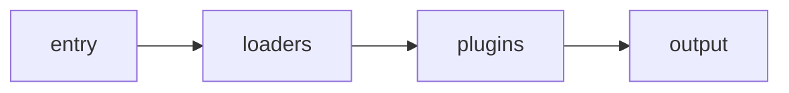

[toc]

## 打包配置
```json
"scripts": {
  "build": "webpack",
},
```
执行命令：npm run build

## 核心配置
#### mode
模式 : "production" | "development" | "none"
```js
module.exports = {
  mode: 'production'
}
```

#### entry
指定打包⼊口文件，有三种不同的形式：string | object | array
```js
module.exports = {
  entry: './src/index.js'
}

module.exports = {
  entry: [
    './src/index1.js',
    './src/index2.js',
  ]
}

module.exports = {
  entry: {
    'index1': "./src/index1.js",
    'index2': "./src/index2.js"
  }
}
```
#### output
打包后的文件位置
```js
module.exports = {
  ...,
  output: {
    path: path.resolve(__dirname, "dist"),
    filename: "[name].js"
  }
}
```

#### 深入
模块不仅仅只是 js 文件，webpack 可以把任意文件数据作为模块进行处理，包括：非 js 文本、css、图片等等
但是 webpack 默认情况下只能处理 js 模块，如果需要处理其它类型的模块，则需要使用它提供的一些其它功能
##### 执行简要流程

- loaders：webpack 支持使用 loader 对文件进行预处理。可以构建包括 JavaScript 在内的任何静态资源。并且可以使用 Node.js 轻松编写自己的 loader
- plugins：主要是扩展 webpack 本身的一些功能，它们会运行在各种模块解析完成以后的打包编译阶段，比如对解析后的模块文件进行压缩等

##### loaders
```js
module.exports = {
  ...,
  module: {
    rules:[
      {
        test:/\.xxx$/,
        use:{
          loader: 'xxx-load'
        }
      }
    ]
  }
}
```
当 webpack 碰到不识别的模块的时候，webpack 会在配置的 module 中进行该文件解析规则的查找
- rules：为不同类型的文件定义的解析规则对应的 loader，它是一个数组
- test：每一种类型规则通过 test 选项来定义，通过正则进行匹配，通常我们会通过正则的方式来匹配文件后缀类型
- use：针对匹配到的文件类型，调用对应的 loader 进行处理

##### Plugins
扩展 webpack 本身的一些功能，它们会运行在各种模块解析完成以后的打包编译阶段，比如对解析后的模块文件进行压缩等
###### HtmlWebpackPlugin
在打包结束后，⾃动生成⼀个 html ⽂文件，并把打包生成的 js 模块引⼊到该 html 中
> npm install --save-dev html-webpack-plugin
```js
const HtmlWebpackPlugin = require("html-webpack-plugin");
module.exports = {
  ...
  plugins: [
     new HtmlWebpackPlugin({
       title: "My App",
       filename: "app.html",
       template: "./index.html"
     }) 
  ]
};
```
在 `html` 模板中，可以通过 `<%=htmlWebpackPlugin.options.XXX%>` 的方式获取配置的值
```html
如：<title><%=htmlWebpackPlugin.options.title%></title>
```
**更多配置**
- `title`: ⽤来生成⻚面的 `title` 元素
- `filename`: 输出的 `HTML` ⽂件名，默认是 `index.html`， 也可以直接配置子目录
- `template`: 模板⽂件路径，⽀持加载器（`loader`），⽐如 `html!./index.html`
- `inject`: `true | 'head' | 'body' | false`，注⼊所有的资源到特定的 `template` 或者 `templateContent` 中，如果设置为 `true` 或者 `body`，所有的 `javascript` 资源将被放置到 `body` 元素的底部，`'head'` 将放置到 `head` 元素中
- `favicon`: 添加特定的 `favicon` 路径到输出的 `HTML` 文件中
- `minify`: `{} | false`， 传递 `html-minifier` 选项给 `minify` 输出
- `hash`: `true | false`，如果为 `true`，将添加 `webpack` 编译生成的 `hash` 到所有包含的脚本和 `CSS` ⽂件，对于解除 `cache` 很有用
- `cache`: `true | false`，如果为 `true`，这是默认值，仅在文件修改之后才会发布文件
- `showErrors`: `true | false`，如果为 `true`，这是默认值，错误信息会写入到 `HTML` ⻚面中
- `chunks`: 允许只添加某些块 (⽐如，仅 unit test 块)
- `chunksSortMode`: 允许控制块在添加到⻚面之前的排序方式，⽀持的值:`'none' | 'default' |{function}-default:'auto'`
- `excludeChunks`: 允许跳过某些块，(⽐如，跳过单元测试的块)

###### CleanWebpackPlugin
删除（清理）构建目录，只保留要打包的文件，其余的东西都删除掉
> npm install --save-dev clean-webpack-plugin
```js
const {CleanWebpackPlugin} = require('clean-webpack-plugin');
module.exports = {
  ...
  plugins: [
    ...,
    new CleanWebpackPlugin(),
    ...
  ]
}
```

###### MiniCssExtractPlugin
提取 CSS 到一个单独的文件中,并使用link的方式引入
css打包原理就是用js将css文件生成link标签，然后挂载到页面中即可

> npm install --save-dev mini-css-extract-plugin
```js
const MiniCssExtractPlugin = require('mini-css-extract-plugin');
module.exports = {
...,
module: {
  rules: [
      {
        test: /\.(s[ac]ss|less|css)$/,
        use: [
          {
            loader: MiniCssExtractPlugin.loader
          },
          'css-loader',
        ]
      }
    ]
  },
  plugins: [
    ...,
    new MiniCssExtractPlugin({
      filename: '[name].css'
    }),
    ...
  ]
}
```

##### sourceMap
我们实际运行在浏览器的代码是通过 webpack 打包合并甚至是压缩混淆过的代码，所生成的代码并不利于我们的调试和错误定位，我们可以通过 sourceMap 来解决这个问题，sourceMap 本质是一个记录了编译后代码与源代码的映射关系的文件，我们可以通过 webpack 的 devtool 选项来开启 sourceMap。编译后会为每一个编译文件生成一个对应的 .map 文件，同时在编译文件中添加一段对应的 map 文件引入代码
```js
module.exports = {
  mode: 'production',
  devtool: 'source-map',
  ...
}
```

##### WebpackDevServer
每次的代码修改都需要重新编译打包，刷新浏览器，特别麻烦，我们可以通过安装 webpackDevServer 热重载来改善这方面的体验
> npm install --save-dev webpack-dev-server

在package.json 中添加 scripts；启动命令为 npm run dev
```json
"scripts": {
  "dev": "webpack serve --open"
}
```
修改 webpack.config.js
```js
module.exports = {
  ...,
  devServer: {
    // 生成的虚拟目录路径
    contentBase: "./dist",
    // 自动开启浏览器
    open: true,
    // 端口
    port: 9527
  }
}
```
启动服务以后，webpack 不在会把打包后的文件生成到硬盘真实目录中了，而是直接存在了内存中(同时虚拟了一个存放目录路径)，后期更新编译打包和访问速度大大提升

##### Proxy
前端开发过程中代码会运行在一个服务器环境下(如当前的 WebpackDevServer)，那么在处理一些后端请求的时候通常会出现跨域的问题。WebpackDevServer 内置了一个代理服务，通过内置代理就可以把我们的跨域请求转发目标服务器上(WebpackDevServer 内置的代理发送的请求属于后端 - node，不受同源策略限制)，具体如下：
```js
devServer: {
  // 生成的虚拟目录路径
  contentBase: "./dist",
  // 自动开启浏览器
  open: true,
  // 端口
  port: 9527,
  proxy: {
    '/api': {
      target: 'https://storetest.cdhqht.com',
      changeOrigin: true,
      pathRewrite: {
        '^/api': ''
      }
    }
  }
}
```

##### Hot Module Replacement
在之前当代码有变化，我们使用的 live reload，也就是刷新整个页面，虽然这样为我们省掉了很多手动刷新页面的麻烦，但是这样即使只是修改了很小的内容，也会刷新整个页面，无法保持页面操作状态。HMR 随之就出现了，它的核心的局部（模块）更新，也就是不刷新页面，只更新变化的部分，即热替换
```js
devServer: {
  // 生成的虚拟目录路径
  contentBase: "./dist",
  // 自动开启浏览器
  open: true,
  // 端口
  port: 9527
  // 开启热更新
  hot:true,
  // 即使 HMR 不生效，也不去刷新整个页面(选择开启)
  hotOnly:true,
}
```
开启 HMR 以后，当代码发生变化，webpack 即会进行编译，并通过 websocket 通知客户端(浏览器)，我们需要监听处理来自 webpack 的通知，然后通过 HMR 提供的 API 来完成我们的局部更新逻辑
```js
export default function() {
    console.log('start1!');
}
```

```js
import fn1 from './fn1.js';
box1.onclick = fn1;

if (module.hot) {//如果开启 HMR
    module.hot.accept('./fn1.js', function() {
      // 更新逻辑
      box1.onclick = fn1;
    })
}
```
上面代码就是 当 ./fn1.js 模块代码发生变化的时候，把最新的 fn1 函数绑定到 box1.onclick 上
HMR 其实就是以模块为单位，当模块代码发生修改的时候，通知客户端进行对应的更新，而客户端则根据具体的模块来更新我们的页面逻辑(这些逻辑需要自己去实现)，当前已经有一些常用的更新逻辑都有了现成的插件

## 基本底层原理
```js
// 步骤一，实现exports.default调用方式
var exports = {};
(function (exports,code) {
  eval(code)
})(exports,'exports.default = function (a,b) { return a + b }');
console.log(exports.default(1,2))

// 步骤二，封装一个require函数调用
function require(file) {
  var exports = {};
  (function (exports,code) {
    eval(code)
  })(exports,'exports.default = function (a,b) { return a + b }')
  return exports;
}

var add = require('add.js').default;
console.log(add(1,2))

// 步骤三，将执行操作写活
(function (list) {
  function require(file) {
      var exports = {};
      (function (exports, code) {
          eval(code)
      })(exports, list[file])
      return exports;
  }
  require('index.js')
})({
    'index.js': `
    var add = require('add.js').default;
    print(add(5,4))
    `,
    'add.js': `
    exports.default = function (a,b) { return a + b }
    `
})
```

## AST能干吗
- 构建工具
- 代码补全
- 代码检查（eslint）
- 埋点
- 代码高亮
- 代码格式化（pretter）